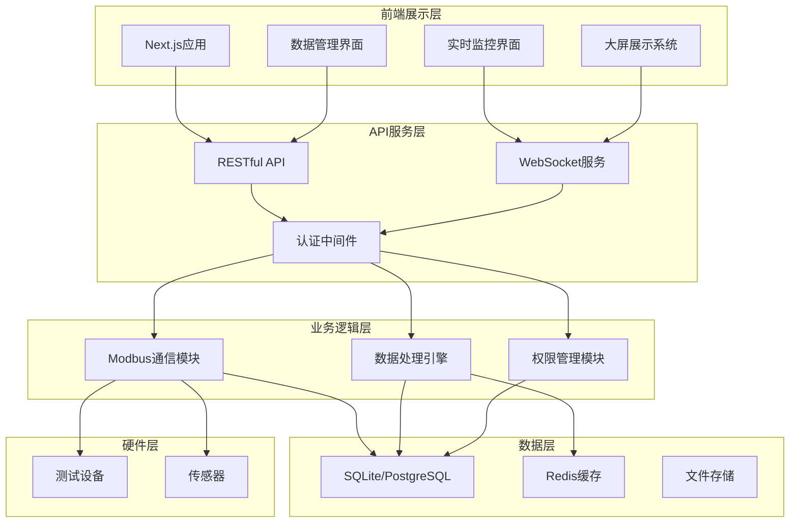

# 光伏关断器负载电压电流测试与数据管理系统

<div align="center">
  
  
  <h3>工业级光伏测试与数据管理平台</h3>
  
  <p>
    
    
    
    
  </p>
</div>

---

## 📋 项目简介

光伏关断器负载电压电流测试与数据管理系统是一个专为光伏行业打造的工业级测试平台。系统基于现代Web技术栈，实现了从设备控制、数据采集到可视化展示的全流程自动化管理。

### 核心特性

- 🔧 **Modbus RTU 通信** - 工业标准协议，稳定可靠
- ⚡ **高频数据采集** - 支持最高1000Hz采样率
- 📊 **实时数据可视化** - 工业级曲线展示和大屏监控
- 🔐 **本地化部署** - 数据安全，完全掌控
- 🎨 **现代化UI** - 高端工业美学设计

---

## 🏗️ 系统架构

### 技术栈

#### 前端技术
- **框架**: Next.js 14 (App Router)
- **UI框架**: TailwindCSS 3.4
- **组件库**: Radix UI + Shadcn/ui
- **图表库**: Chart.js + Recharts
- **状态管理**: Zustand
- **实时通信**: Socket.io-client

#### 后端技术
- **运行时**: Node.js 18+
- **框架**: Express.js
- **通信协议**: Modbus RTU (serialport)
- **数据库**: SQLite / PostgreSQL
- **实时通信**: Socket.io
- **认证**: JWT

#### 开发工具
- **包管理**: pnpm
- **代码规范**: ESLint + Prettier
- **Git Hooks**: Husky + lint-staged
- **测试**: Jest + React Testing Library

### 系统架构图



---

## 🚀 快速开始

### 环境要求

- Node.js >= 18.0
- pnpm >= 8.0
- Git

### 安装步骤

1. **克隆项目**
```bash
git clone https://github.com/your-repo/pv-testing-system.git
cd pv-testing-system
```

2. **安装依赖**
```bash
pnpm install
```

3. **环境配置**
```bash
cp .env.example .env.local
# 编辑 .env.local 配置数据库、串口等参数
```

4. **数据库初始化**
```bash
pnpm db:migrate
pnpm db:seed
```

5. **启动开发服务器**
```bash
pnpm dev
```

6. **访问系统**
```
http://localhost:3000
```

### 生产部署

1. **构建项目**
```bash
pnpm build
```

2. **启动生产服务**
```bash
pnpm start
```

3. **使用PM2管理进程**
```bash
pm2 start ecosystem.config.js
```

---

## 📁 项目结构

```
pv-testing-system/
├── app/                      # Next.js App Router
│   ├── (auth)/              # 认证相关页面
│   ├── (dashboard)/         # 仪表板页面
│   ├── api/                 # API路由
│   ├── components/          # 页面组件
│   └── layout.tsx           # 根布局
├── components/              # 通用组件
│   ├── ui/                 # UI基础组件
│   ├── charts/             # 图表组件
│   ├── modbus/             # Modbus控制组件
│   └── layout/             # 布局组件
├── lib/                     # 工具库
│   ├── modbus/             # Modbus通信
│   ├── database/           # 数据库操作
│   ├── auth/               # 认证逻辑
│   └── utils/              # 工具函数
├── services/               # 后端服务
│   ├── api/                # API服务
│   ├── websocket/          # WebSocket服务
│   └── workers/            # 后台任务
├── prisma/                 # 数据库模型
│   ├── schema.prisma       # 数据模型定义
│   └── migrations/         # 数据库迁移
├── public/                 # 静态资源
├── styles/                 # 全局样式
├── tests/                  # 测试文件
└── docs/                   # 项目文档
```

---

## 🔧 功能模块

### 1. 实验控制模块

#### Modbus RTU 通信
- 自动设备发现
- 参数实时读写
- 通信状态监控
- 异常自动重连

#### 单低压高电流测试
- 电压范围：1-50V
- 电流范围：0-1000A
- 精确控制与保护
- 实时参数调节

#### 双电源切换实验
- 毫秒级切换控制
- 切换时序记录
- 瞬态参数捕获
- 成功率统计

### 2. 数据管理模块

#### 数据采集存储
- 高频采样（最高1000Hz）
- 自动数据压缩
- 定时归档策略
- 存储容量监控

#### 查询检索导出
- 多条件组合查询
- 秒级查询响应
- 多格式数据导出
- 批量操作支持

### 3. 可视化模块

#### 实时曲线展示
- 多参数同步显示
- 10ms级实时刷新
- 交互式操作
- 异常标注提醒

#### 历史数据分析
- 任意时段回放
- 多组数据对比
- 趋势分析报告
- 统计图表生成

### 4. 大屏展示模块

#### 数据总览大屏
- 4K分辨率适配
- 关键指标展示
- 实时数据更新
- 可定制化布局

---

## 🎨 UI/UX 设计

### 设计理念
- **工业美学**: 简洁、精准、专业
- **现代风格**: 扁平化、渐变、动效
- **用户体验**: 直观、高效、响应式

### 主题配置
```javascript
// tailwind.config.js
module.exports = {
  theme: {
    extend: {
      colors: {
        primary: {
          50: '#E0F2FE',
          500: '#0D9488',
          900: '#1B263B'
        },
        industrial: {
          dark: '#111827',
          card: '#1F2937',
          border: '#374151'
        }
      }
    }
  }
}
```

---

## 🔒 安全性

### 认证授权
- JWT Token认证
- 基于角色的权限控制（RBAC）
- 会话管理
- 操作审计日志

### 数据安全
- 传输加密（HTTPS）
- 数据库加密存储
- 定期自动备份
- 访问控制列表

---

## 📊 性能优化

### 前端优化
- 代码分割和懒加载
- 图片优化（Next.js Image）
- 缓存策略
- 虚拟滚动

### 后端优化
- 数据库索引优化
- 查询结果缓存
- 连接池管理
- 负载均衡

---

## 🧪 测试

### 单元测试
```bash
pnpm test:unit
```

### 集成测试
```bash
pnpm test:integration
```

### E2E测试
```bash
pnpm test:e2e
```

### 测试覆盖率
```bash
pnpm test:coverage
```

---

## 📚 API文档

### 基础信息
- Base URL: `http://localhost:3000/api/v1`
- 认证方式: Bearer Token
- 响应格式: JSON

### 主要接口

#### 认证接口
```http
POST /auth/login
POST /auth/logout
POST /auth/refresh
```

#### 实验控制
```http
POST /experiment/start
POST /experiment/stop
GET  /experiment/status
PUT  /experiment/config
```

#### 数据管理
```http
GET  /data/query
GET  /data/export
GET  /data/statistics
POST /data/archive
```

详细API文档请查看 [API Documentation](./docs/api.md)

---

## 🛠️ 维护指南

### 日志管理
- 日志位置：`./logs/`
- 日志级别：error, warn, info, debug
- 日志轮转：每日轮转，保留30天

### 数据库维护
```bash
# 备份数据库
pnpm db:backup

# 恢复数据库
pnpm db:restore

# 清理旧数据
pnpm db:cleanup
```

### 性能监控
- 使用PM2监控进程状态
- 定期检查数据库性能
- 监控API响应时间

---

## 🤝 贡献指南

1. Fork 项目
2. 创建功能分支 (`git checkout -b feature/AmazingFeature`)
3. 提交更改 (`git commit -m 'Add some AmazingFeature'`)
4. 推送到分支 (`git push origin feature/AmazingFeature`)
5. 开启 Pull Request

### 代码规范
- 遵循 ESLint 配置
- 使用 Prettier 格式化
- 编写单元测试
- 更新相关文档

---

## 📄 许可证

本项目采用 MIT 许可证 - 查看 [LICENSE](LICENSE) 文件了解详情

---

## 📞 联系我们

- 项目主页: [https://github.com/your-repo/pv-testing-system](https://github.com/your-repo/pv-testing-system)
- 问题反馈: [Issues](https://github.com/your-repo/pv-testing-system/issues)
- 邮箱: support@pv-testing.com

---

## 🙏 致谢

感谢所有为本项目做出贡献的开发者！

---

## 📅 任务追踪

### 已完成任务
- [x] 编写PRD文档 - 2025-01-09
- [x] 编写README文档 - 2025-01-09

### 进行中任务
- [ ] 开发实验控制界面
- [ ] 开发数据管理系统
- [ ] 开发曲线展示系统
- [ ] 开发数据总览大屏

### 发现的子任务
- [ ] 配置ESLint和Prettier
- [ ] 设置Git Hooks
- [ ] 创建UI组件库
- [ ] 实现Modbus通信模块

---

**最后更新**: 2025-01-09
